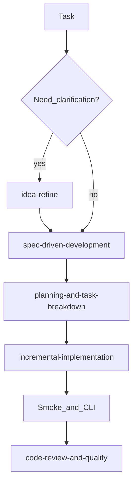

# Policy change playbook (resources-aligned)

Improving the Superskill policy engine with [`resources/skills/`](../resources/skills/) is about **methodology** and **review discipline**, not about loading those files at runtime. Use the skill library to move from ambiguity to spec, break work into verifiable steps, change **policy YAML**, **JSON schemas**, and **`lib/` / CLI** code in small increments, then validate with `npm run smoke` and targeted CLI commands. Treat skills such as code review and security/hardening as the bar for anything that touches path rules, validation, or user-supplied files. The published npm package does **not** bundle `resources/`; gains come from *how* you change the repo, not from shipping SKILL files inside the tarball.

## Scope

- **Who this is for:** Maintainers working in this repository on the policy engine (policies, config, schemas, CLI, `lib/`).
- **`resources/`:** Optional workflow guidance. Open the relevant `SKILL.md` when you need a structured process; keep deep content in those files so it does not drift from a short playbook.
- **Shipped product:** The package remains [`package.json`](../package.json), [`lib/`](../lib/), [`policies/`](../policies/), [`cli/`](../cli/), and [`schemas/`](../schemas/). Do not assume consumers have `resources/`.

## Decision flow (policy engine)

Use this as a high-level route. Details live in each skill under [`resources/skills/`](../resources/skills/).

For cross-cutting concerns, pull in additional skills as needed (for example `api-and-interface-design` when changing CLI flags or JSON shapes, `documentation-and-adrs` when changing protocols or publishing steps, `security-and-hardening` when editing validation or path boundaries, `debugging-and-error-recovery` for regressions).

## Task → skill → repo → verify

| Example task | Skill folder under `resources/skills/` | Primary repo touchpoints | Verify |
|--------------|----------------------------------------|---------------------------|--------|
| New or ambiguous requirement | `idea-refine` | — (clarify before editing code) | Human sign-off on intent |
| Behavioral change to resolution / contracts | `spec-driven-development` | [`ROADMAP.md`](ROADMAP.md), short design note or ADR | — |
| Break work into PR-sized steps | `planning-and-task-breakdown` | [`CURRENT_DEVELOPMENT.md`](CURRENT_DEVELOPMENT.md) stays accurate | — |
| Edit YAML policies | `incremental-implementation` | [`superskill.yaml`](../superskill.yaml), [`policies/`](../policies/) | [`npm run smoke`](../package.json), relevant `node cli/src/index.mjs ...` |
| Change CLI or JSON surface | `api-and-interface-design` | [`cli/src/index.mjs`](../cli/src/index.mjs), [`cli/README.md`](../cli/README.md) | Smoke + manual CLI |
| Handoff, trace, or outcome schemas | `api-and-interface-design` + `documentation-and-adrs` | [`schemas/`](../schemas/), [`HANDOFF_PROTOCOL.md`](HANDOFF_PROTOCOL.md), Phase 4 docs as needed | `validate-handoff`, `trace-append` / `outcome-append`, etc. |
| Regression or bugfix | `debugging-and-error-recovery` | Narrow change in [`lib/`](../lib/), keep smoke green | `npm run smoke` |
| Pre-merge review | `code-review-and-quality` (+ `security-and-hardening` for trust boundaries) | PR diff | Team process |
| Release / consumers | `documentation-and-adrs` + `shipping-and-launch` | [`PUBLISHING_NPM.md`](PUBLISHING_NPM.md), version/changelog if you use them | Publish checklist |

Paths in the Skill column are relative to `resources/skills/<name>/SKILL.md`.

## Skill routing (meta)

At the start of a session or when unsure which process to use, open **[`resources/skills/using-agent-skills/SKILL.md`](../resources/skills/using-agent-skills/SKILL.md)**. It describes how to pick a skill by task type and shared behaviors (assumptions, stopping on confusion). Use it as the index; this playbook only maps Superskill-specific work to those skills.

## Non-goals

- **Do not** paste full SKILL bodies into `docs/` — duplicate content will drift; link to `resources/skills/*` instead.
- **Do not** add `resources/` to the npm package `files` list as part of this playbook unless you deliberately decide to ship workflow docs to consumers (separate product decision).
- **Do not** treat skills as substitutes for `npm run smoke` or schema validation; they discipline the *process*, not replace mechanical checks.

## Success check

You can answer: “I want to add a new output contract” → which skill to read first, which files to edit (`policies/output-policy.yaml`, `superskill.yaml` paths if needed, docs), and which commands prove it (`validate-output`, smoke). Keep iterating with the linked skills when scope grows.
